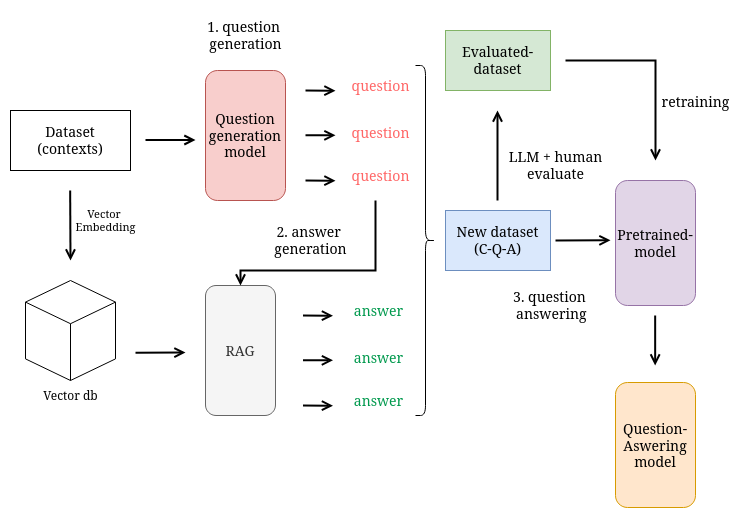

# RaGenVI: A framework for automatically generating Vietnamese QA data by utilizing existing RAG systems

  
   
  <em>Figure 1: Architecture Overview.</em>

1. Question generation 
We propose two method with beam search and random sampling, to combine quality and diversity,
the generated questions are then used as candidate answers for Answer Generation task.
By feeding context into <a href="https://huggingface.co/doc2query/msmarco-t5-base-v1">Doc2query</a> model,
we expanded the document into Context-Question dataset.

3. Answer generation 
The candidate questions ared fed into LLM model (Llama 3.2 3b model), processed with vietnamese embedding model to generate answer.
Instead of using LLM directly, we utilized the existing RAG system in our chatbot with fine-tuned prompts to enhance quality of answer generated.
Obtained dataset with triplet Context-Question-Answer

5. Evaluation 
Currently with human ground truth and RAGAS framework (LLM evaluation). The evaluation process is under development for the next research topic,
by using reinforcement learning from human feedback (RLFH) to evaluate if the generated dataset is applicable.
